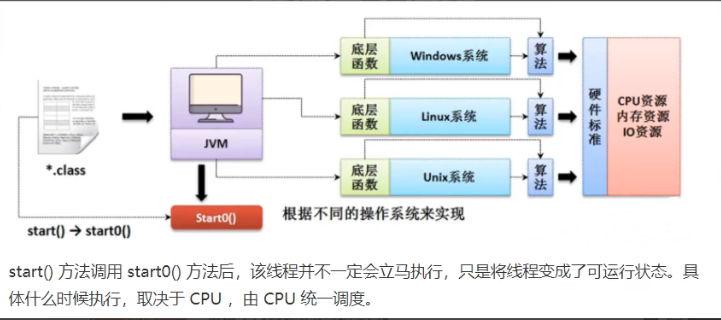
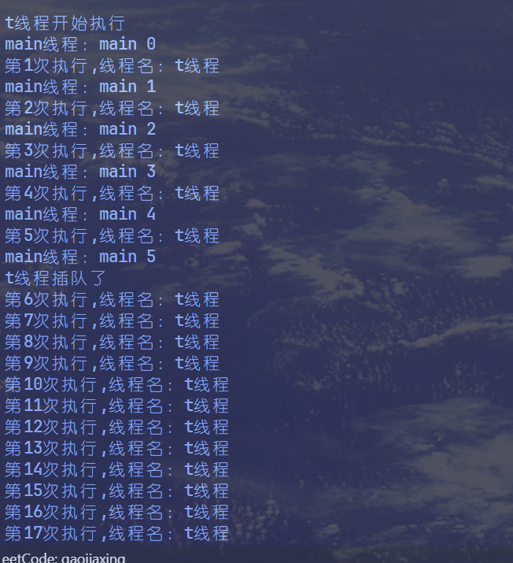
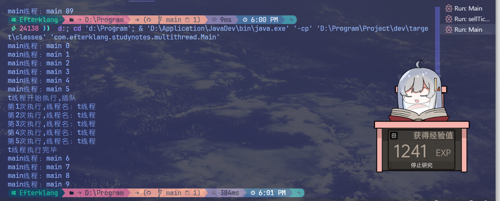
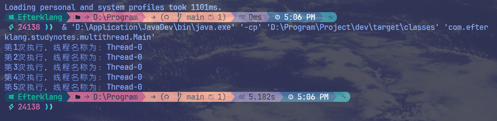
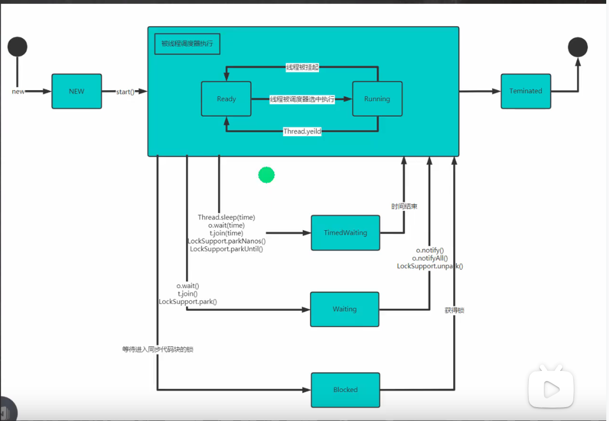

# 十七、多线程编程

## 线程 ＆ 进程

### Introduction

#### 进程基础

##### **① 什么是进程**

结合上文的简单解释，下面给出进程的科学定义：**进程是程序在某个数据集合上的一次运行活动，也是操作系统进行资源分配和保护的基本单位**。

通俗来说，**进程就是程序的一次执行过程**，程序是静态的，它作为系统中的一种资源是永远存在的。而进程是动态的，它是动态的产生，变化和消亡的，拥有其自己的生命周期。

举个例子：同时挂三个 QQ 号，它们就对应三个 QQ 进程，退出一个就会杀死一个对应的进程。但是，就算你把这三个 QQ 全都退出了，QQ 这个程序死亡了吗？显然没有。

进程不仅包含正在运行的程序实体，并且包括这个运行的程序中占据的所有系统资源，比如说 CPU、内存、网络资源等。很多小伙伴在回答进程的概念的时候，往往只会说它是一个运行的实体，而会忽略掉进程所占据的资源。比如说，同样一个程序，同一时刻被两次运行了，那么他们就是两个独立的进程。

##### **② 进程的组成**

进程主要由三个部分组成：

1）**进程控制块 PCB**。包含如下几个部分：

* 进程描述信息
* 进程控制和管理信息
* 资源分配清单
* CPU 相关信息

2）**数据段**。即进程运行过程中各种数据（比如程序中定义的变量）

3）**程序段**。就是程序的代码（指令序列）

举个例子：同时挂三个 QQ 号，会对应三个 QQ 进程，它们的 PCB、数据段各不相同，但程序段的内容都是相同的 （都是运行着相同的 QQ 程序）


PCB 是提供给操作系统用的，而程序段、数据段是给进程自己用的

> PCB(Process Control Block)
>
> 每个进程有且仅有一个进程控制块（Process Control Block，PCB），或称进程描述符，它是**进程存在的唯一标识**，是**操作系统用来记录和刻画进程状态及环境信息的数据结构**，也是操作系统掌握进程的唯一资料结构和管理进程的主要依据。所以说 PCB 是提供给操作系统使用的。
>
> 通俗的解释：操作系统需要对各个进程进行管理，但凡管理时所需要的信息，都会被放在 PCB 中，**PCB 是进程存在的唯一标志**。创建进程和撤销进程等都是指对 PCB 的操作，当进程被创建时，操作系统为其创建 PCB，当进程结束时，会回收其 PCB。
>
> 一般来说，PCB 会包含如下四类信息：
>
> 1）**进程描述信息**：用来让操作系统区分各个进程
>
> * 当进程被创建时，操作系统会为该进程分配一个唯一的、不重复的 “身份证号”— **PID**（ProcessID，进程 ID）
> * 另外，进程描述信息还包含进程所属的用户 ID（**UID**）
>
> 2）**进程控制和管理信息**：记录进程的运行情况。比如 CPU 的使用时间、磁盘使用情况、网络流量使用情况等。
>
> 3）**资源分配清单**：记录给进程分配了哪些资源。比如分配了多少内存、正在使用哪些 I/O 设备、正在使用哪些文件等。
>
> 4）**CPU 相关信息**：进程在让出 CPU 时，必须保存该进程在 CPU 中的各种信息，比如各种寄存器的值。用于实现进程切换，确保这个进程再次运行的时候恢复 CPU 现场，从断点处继续执行。这就是所谓的**保存现场信息**。
>
> 

##### ③进程的状态

尽管每一个进程都是独立的实体，有其自己的 PCB 和内部状态，但是进程之间经常需要相互作用。一个进程的输出结果可能是另一个进程的输入。假设进程 A 的输入依赖进程 B 的输出，那么在进程 B 的输出结果没有出来之前，进程 A 就无法执行，它就会被阻塞。这就是进程的阻塞态。

经典的进程三态模型如下：

* **运行态**（running）：进程占有 CPU 正在运行
* **就绪态**（ready）：进程具备运行条件，等待系统分配 CPU 以便运行
* **阻塞态** / 等待态（wait）：进程不具备运行条件，正在等待某个事件的完成


上图中的**时间片用完**，可以这样理解：

进程是并发执行的嘛，宏观上在一段时间内能同时运行多个程序，但其实微观上是交替发生的。也就是说 CPU 一般不会让一个进程一次性执行完，为了保证所有进程可以得到公平调度，CPU 时间被划分为一段段的时间片，这些时间片再被轮流分配给各个进程。某个进程的时间片用完后这个进程就会进入就绪态，而其他被分配到时间片的进程就会进入运行态。这个处于就绪态的进程就需要等待进程调度程序的下一次调度，为其分配 CPU 时间片后才能再次恢复运行

需要注意的是：**阻塞态是由于缺少需要的资源从而由运行态转换而来，但是该资源不包括 CPU 时间片，缺少 CPU 时间片会从运行态转换为就绪态**。

很多系统中都增加了新建态（new）和终止态（exit），形成**五态模型**：

* **新建态**（new）：进程正在被创建时的状态
* **终止态**（exit）：进程正在从系统中消失时的状态


从上图可以发现，**只有就绪态和运行态可以相互转换，其它的都是单向转换**。

这些不同状态的进程操作系统是如何进行管理的呢？上文说过，PCB 是提供给操作系统使用的，是操作系统管理进程的主要依据。没错，操作就是通过 PCB 来管理这些拥有不同状态的进程的。

进程的 PCB 会通过某种方式组织起来，一般来说，操作系统会把处于同一状态的所有进程的 PCB 链接在一起，这种数据结构就称为**进程队列**（Process Queue）

##### ④进程控制

所谓进程控制就是对系统中的所有进程实施有效的管理，**实现进程状态转换**功能。包括创建进程、阻塞进程、唤醒进程、终止进程等，这些功能均由**原语**来实现，操作系统通过原语来完成进程原理，包括进程的同步和互斥、进程的通信和管理。

**什么是原语**？原语是一种特殊的程序，它的执行具有**原子性**。 也就是说，这段程序的运行必须一气呵成，不可中断。原语是操作系统内核里的一段程序


思考一下：为什么进程控制（进程状态转换）的过程要一气呵成，不可中断？

答：如果进程状态转换的过程不能一气呵成，就有可能导致操作系统中的某些关键数据结构信息不统一，这会影响操作系统进行别的管理工作

###### 进程创建

操作系统初始启动时会创建承担系统资源分配和控制管理的一些系统进程，同时还会创建一个所有用户进程的祖先，其他用户进程是在应用程序运行时创建的。

操作系统允许一个进程创建另一个进程，而且允许子进程继承父进程所拥有的资源，当子进程被终止时，其在父进程处继承的资源应当还给父进程。同时，终止父进程时同时也会终止其所有的子进程。

创建进程的过程，也就是**创建原语**包含的内容如下：

* 在进程列表中增加一项，从 PCB 池中申请一个空闲的 PCB（PCB 是有限的，若申请失败则创建失败），为新进程分配一个唯一的进程标识符；
* 为新进程分配地址空间，由进程管理程序确定加载至进程地址空间中的程序；
* 为新进程分配各种资源；
* 初始化 PCB，如进程标识符、CPU 初始状态等；
* 把新进程的状态设置为就绪态，并将其移入就绪队列，等待被调度运行。

**什么事件会触发进程的创建呢**？有如下四种情况：

* 用户登录：分时系统中，用户登录成功，系统会为其建立一个新的进程
* 作业调度：多道批处理系统中，有新的作业放入内存中，会为其建立一个新的进程
* 提供服务：用户向操作系统提出某些请求时，会新建一个进程处理该请求
* 应用请求：由用户进程主动请求创建一个子进程

###### 进程的终止

进程的终止也称为撤销，进程完成特定工作或出现严重错误后必须被终止。引起进程终止的事件有三种：

* 正常结束：进程自己请求终止（exit 系统调用）
* 异常结束：比如整数除 0，非法使用特权指令，然后被操作系统强行终止
* 外界干预：Ctrl + Alt + delete 打开进程管理器，用户手动杀死进程

终止（撤销）进程的过程，也就是**撤销原语**包含的内容如下：

* 从 PCB 集合中找到终止进程的 PCB；
* 若进程处于运行态，则立即剥夺其 CPU，终止该进程的执行，然后将 CPU 资源分配给其他进程；
* 如果其还有子进程，则应将其所有子进程终止；
* 将该进程所拥有的全部资源都归还给父进程或操作系统；
* 回收 PCB 并将其归还至 PCB 池

###### 进程的阻塞和唤醒

进程阻塞是指进程让出 CPU 资源转而等待一个事件，如等待资源、等待 I/O 操作完成等。进程通常使用阻塞原语来阻塞自己，所以阻塞是进程的自主行为，是一个同步事件。当等待事件完成时会产生一个中断，激活操作系统，在系统的控制下将被阻塞的进程唤醒，也就是唤醒原语。

进程的阻塞和唤醒显然是由进程切换来完成的。

进程的阻塞步骤，也就是**阻塞原语**的内容为：

* 找到将要被阻塞的进程对应的 PCB；
* 保护进程运行现场，将 PCB 状态信息设置为阻塞态，暂时停止进程运行；
* 将该 PCB 插入相应事件的阻塞队列（等待队列）。

进程的唤醒步骤，也就是**唤醒原语**的内容为：

* 在该事件的阻塞队列中找到相应进程的 PCB；
* 将该 PCB 从阻塞队列中移出，并将进程的状态设置为就绪态；
* 把该 PCB 插入到就绪队列中，等待被调度程序调度。

阻塞原语和唤醒原语的作用正好相反，**阻塞原语使得进程从运行态转为阻塞态，而唤醒原语使得进程从阻塞态转为就绪态**。如果某个进程使用阻塞原语来阻塞自己，那么他就必须使用唤醒原语来唤醒自己，因何事阻塞，就由何事唤醒，否则被阻塞的进程将永远处于阻塞态。因此，**阻塞原语和唤醒原语是成对出现的**。

##### ⑤进程上下文切换

所谓进程的上下文切换，就是说各个进程之间是共享 CPU 资源的，不可能一个进程永远占用着 CPU 资源，不同的时候进程之间需要切换，使得不同的进程被分配 CPU 资源，这个过程就是进程的上下文切换，**一个进程切换到另一个进程运行**。

因为进程是由内核进行管理和调度的，所以**进程的上下文切换一定发生在内核态**。

进程上下文的切换也是一个原语操作，称为**切换原语**，其内容如下：

* 首先，将进程 A 的运行环境信息存入 PCB，这个运行环境信息就是进程的上下文（Context）
* 然后，将 PCB 移入相应的进程队列；
* 选择另一个进程 B 进行执行，并更新其 PCB 中的状态为运行态
* 当进程 A 被恢复运行的时候，根据它的 PCB 恢复进程 A 所需的运行环境

引起进程上下文切换的事件，也就是某个占用 CPU 资源运行的当前进程被赶出 CPU 的原因有如下：

* 当前进程的时间片到
* 有更高优先级的进程到达
* 当前进程主动阻塞
* 当前进程终止

#### 线程基础

##### ①什么是线程

**一个进程中可以有多个线程，它们共享这个进程的资源。**

举个例子，QQ 和 Chrome 浏览器是两个进程，Chrome 进程里面有很多线程，例如 HTTP 请求线程、事件响应线程、渲染线程等等，线程的并发执行使得在浏览器中点击一个新链接从而发起 HTTP 请求时，浏览器还可以响应用户的其它事件。

##### ② 为什么要引入线程

早期的操作系统都是以进程作为独立运行的基本单位的，直到后期计算机科学家们又提出了更小的能独立运行的基本单位，也就是线程。这就好比物理学家研究物质组成一样：先发现了分子，然后继续细分发现原子，再后来是原子核和电子、夸克等等。

那么，为什么要引入线程呢？我们只需要记住这句话：**线程又称为迷你进程，但是它比进程更容易创建，也更容易撤销**。

从上文我们知道，进程是拥有资源的基本单位，而且还能够进行独立调度，这就犹如一个随时背着粮草的士兵，这必然会造成士兵的执行命令（战斗）的速度。所以，一个简单想法就是：分配两个士兵执行同一个命令：一个负责携带所需粮草随时供给，另一个士兵负责执行命令（战斗）。这就是线程的思想，**轻装上阵的士兵就是线程**。

用严谨的语言描述来说就是：由于创建或撤销进程时，系统都要为之分配或回收资源，如内存空间、I/O 设备等，需要较大的时空开销，限制了并发程度的进一步提高。为减少进程切换的开销，**把进程作为资源分配单位和调度单位这两个属性分开处理**，即进程还是作为资源分配的基本单位，但是不作为调度的基本单位（很少调度或切换），把调度执行与切换的责任交给线程，即**线程成为独立调度的基本单位**，它比进程更容易（更快）创建，也更容易撤销

> 记住这句话！引入线程前，进程是资源分配和独立调度的基本单位。引入线程后，**进程是资源分配的基本单位，线程是独立调度的基本单位**。

##### ③线程的优缺点

线程的特征和进程差不多，进程有的他基本都有，比如：

* 线程具有就绪、阻塞、运行三种基本状态，同样具有状态之间的转换关系；
* 线程间可以并发执行
* 在多 CPU 环境下，各个线程也可以分派到不同的 CPU 上并行执行

线程的优点：

* 一个进程中可以同时存在多个线程，这些线程共享该进程的资源。进程间的通信必须请求操作系统服务（因为 CPU 要切换到内核态），开销很大。而同进程下的线程间通信，无需操作系统干预，开销更小。
  不过，需要注意的是：从属于不同进程的线程间通信，也必须请求操作系统服务。
* 线程间的并发比进程的开销更小，系统并发性提升。
  同样，需要注意的是：从属于不同进程的线程间切换，它是会导致进程切换的，所以开销也大。

线程的缺点：

* 当进程中的一个线程奔溃时，会导致其所属进程的所有线程奔溃。

举个例子，对于游戏的用户设计，就不应该使用多线程的方式，否则一个用户挂了，会影响其他同个进程的线程。

#### 进程VS线程

操作系统的设计，从进程和线程的角度来说，可以归结为三点：

* 以多进程形式，允许多个任务同时运行；
* 以多线程形式，允许单个任务分成不同的部分运行；
* 提供协调机制，一方面防止进程之间和线程之间产生冲突，另一方面允许进程之间和线程之间共享资源。

****

进程和线程是包含关系，但是多任务既可以由多进程实现，也可以由单进程内的多线程实现，还可以混合多进程＋多线程。

具体采用哪种方式，要考虑到进程和线程的特点。

和多线程相比，多进程的缺点在于：

* 创建进程比创建线程开销大，尤其是在Windows系统上；
* 进程间通信比线程间通信要慢，因为线程间通信就是读写同一个变量，速度很快。

而多进程的优点在于：

多进程稳定性比多线程高，因为在多进程的情况下，一个进程崩溃不会影响其他进程，而在多线程的情况下，任何一个线程崩溃会直接导致整个进程崩溃

### 线程使用

#### Java多线程

Java语言内置了多线程支持：一个Java程序实际上是一个JVM进程，JVM进程用一个主线程来执行`main()`方法，在`main()`方法内部，我们又可以启动多个线程。此外，JVM还有负责垃圾回收的其他工作线程等。

因此，对于大多数Java程序来说，我们说多任务，实际上是说如何使用多线程实现多任务。

和单线程相比，多线程编程的特点在于：多线程经常需要读写共享数据，并且需要同步。例如，播放电影时，就必须由一个线程播放视频，另一个线程播放音频，两个线程需要协调运行，否则画面和声音就不同步。因此，多线程编程的复杂度高，调试更困难。

Java多线程编程的特点又在于：

* 多线程模型是Java程序最基本的并发模型；
* 后续读写网络、数据库、Web开发等都依赖Java多线程模型。

#### 并发 & 并行

并发和并行都是指多个任务同时进行的概念，但它们有着不同的含义。

并发是指在一段时间内，多个任务交替执行，每个任务只执行一小部分，然后切换到下一个任务。这种交替执行的方式可以让每个任务看起来是同时执行的。单核CPU实现的多任务就是并发

而并行则是指多个任务真正同时执行，每个任务都在自己的处理器核心上运行，不需要等待其他任务完成。这种方式可以提高程序的执行效率和速度。多核CPU可以实现并行

简而言之， 并发是指多个任务交替执行，而并行是指多个任务同时执行。

#### 创建进程

* 从java的设计来看，通过继承Thread或者实现Runnable接口来创建线程本质上没有区别,从idk帮助文档我们可以看到Thread类本身就实现了Runnable接口

* 实现Runnable接口方式更加适合多个线程共享一个资源的情况，并且避免了单继承的限制，代码如下

  ```java
  T t = new T("Hello");
  //t1,t2线程共享t
  Thread t1 = new Thread(t);
  Thread t2 = new Thread(t);
  t1.start();
  t2.start();
  ```

##### ①继承Thread类，重写run方法

**弊端：**Java为单继承，继承了Thread类不能再继承其他类

```java
package com.efterklang.temp;

public class Main {
    public static void main(String[] args) throws InterruptedException{
        System.out.println("ThreadName = " + Thread.currentThread().getName());
        Cat cat = new Cat();
        cat.start(); //每隔1000ms输出一句Meow
        //main线程启动一个子线程cat，main线程不会阻塞，继续执行下面的for循环，主程序子程序交替执行
        for (int i = 0; i < 10; i++) {
            System.out.println(i);
            Thread.sleep(1000);
        }
    }
}

class Cat extends Thread {
    @Override
    public void run() {
        int times = 0;
        System.out.println("ThreadName = " + Thread.currentThread().getName());
        while (true) {
            try {
                Thread.sleep(1000);
                System.out.println("Meow");
                times++;

            } catch (InterruptedException e) {
                e.printStackTrace();
            }
            if (times == 2) {
                System.out.println("I'm tired. I'm going to sleep now.");
                break;
            }
        }
    }
}

```

> 为什么调用的是`cat.start()`而不是`cat.run()`？
>
>
>
> 在 Java 中，创建线程后，可以通过调用 `start()` 方法来启动线程，也可以通过调用 `run()` 方法来直接执行线程的代码。但是，如果直接调用 `run()` 方法，那么线程就会在当前线程中执行，而不会创建新的线程。
>
> 这是因为 `start()` 方法会在新的线程中启动一个新的调用栈，而 `run()` 方法只是在当前线程中调用了线程的代码。如果直接调用 `run()` 方法，就失去了并发执行的效果，相当于只是在当前线程中按照顺序执行了线程的代码。
>
> 因此，在 Java 中，如果想要实现真正的多线程并发执行，就必须使用 `start()` 方法来启动新的线程。



##### ②实现Runnable接口，重写run方法

**弊端** 虽然没有继承限制，但线程不能返回值

```java
package com.efterklang.temp;

public class Main {
    public static void main(String[] args) throws InterruptedException {
        Cat cat = new Cat();
        Thread catThread = new Thread(cat);
        catThread.start();
    }
}

class Cat implements Runnable {
    @Override
    public void run() {
        int times = 0;
        while (true) {
            try {
                Thread.sleep(1000);
                System.out.println("Meow");
                times++;
            } catch (InterruptedException e) {
                e.printStackTrace();
            }
            if (times == 2) {
                System.out.println("I'm tired. I'm going to sleep now.");
                break;
            }
        }
    }
}
```

Runnable接口没有`start()`方法，需要通过`Thread t1 = new Thread(cat); t1.start()`来实现；底层使用了设计模式[代理模式]

##### ③实现Callable()接口

前面两种方法创建线程的缺点是，线程不能返回值

```java
package com.efterklang.studynotes.multithread;
import java.util.concurrent.Callable;
import java.util.concurrent.FutureTask;
public class Main {
    public static void main(String[] args) throws Exception{
        FutureTask<String> futureTask = new FutureTask<>(new threadTest());
        Thread thread = new Thread(futureTask);
        thread.start();
        String result = futureTask.get();
        System.out.println(result);
    }
}

class threadTest implements Callable<String> {

    @Override
    public String call(){
        return "Hello World!";
    }
}
```

#### 多线程售票代码

##### Code

```java
package com.efterklang.studynotes.multithread;

public class sellTicket {
    public static void main(String[] args) {
        sellTicketThread t1 = new sellTicketThread();
        sellTicketThread t2 = new sellTicketThread();
        sellTicketThread t3 = new sellTicketThread();
        t1.setName("窗口1");
        t2.setName("窗口2");
        t3.setName("窗口3");
        t1.start();
        t2.start();
        t3.start();
    }
}

class sellTicketThread extends Thread {
    private static int ticketNum = 100;

    @Override
    public void run() {
        while (true) {
            if (ticketNum <= 0) {
                System.out.println("票已售完");
                break;
            }

            try {
                Thread.sleep(50);
            } catch (Exception e) {
                e.printStackTrace();
            }

            System.out.println(Thread.currentThread().getName() + "售出一张票，还剩" + ticketNum-- + "张票");
        }
    }
}
```


##### 分析异常 ＆ 解决

超卖现象，3个线程都执行了`if(ticketNum <= 0) {…}`

后面通过Synchronized解决

### 线程方法

#### Method

* `setName`//设置线程名称，使之与参数 name 相同

* `getName` //返回该线程的名称

* `start` //使该线程开始执行; Java 虚拟机底层调用该线程的start0 方法

* `run`//调用线程对象 run 方法

* `setPriority`//更改线程的优先级
  JVM自动把1（低）~10（高）的优先级映射到操作系统实际优先级上（不同操作系统有不同的优先级数量）。优先级高的线程被操作系统调度的优先级较高，操作系统对高优先级线程可能调度更频繁，但我们决不能通过设置优先级来确保高优先级的线程一定会先执行

* `getPriority` //获取线程的优先级(暂停执行)

* `sleep`//在指定的毫秒数内让当前正在执行的线程休眠

* `interrupt` //中断线程

  ```java
  try {
      sleep(114514);
  } catch (InterruptedException e) {
      //线程休眠时，调用Interrupt方法会中断休眠，让其执行此处代码
      ...
  }
  ```

* `yeild` //线程的礼让。让出cpu，让其他线程执行，但礼让的时间不确定，所以也不一定礼让成功
  例如CPU并发执行t1,t2两个线程，执行`t1.yeild()`告诉CPU先执行其他线程

* `join` //线程的插队。插队的线程一旦插队成功，则肯定先执行完插入的线程所有的任务
  案例: 创建一个子线程 ，每隔1s 输出 hello,输出 20次,主线程每隔1秒，输出 hi，输出 20次.要求: 两个线程同时执行，当主线程输出 5次后，就让子线程运行完毕，主线程再继续

#### Exercise

  ```java
package com.efterklang.studynotes.multithread;

public class Main {
    public static void main(String[] args) throws InterruptedException {
        mythread t = new mythread();
        t.setName("t线程");
        System.out.println("t线程开始执行");
        t.start();
        for (int i = 0; i < 100; i++) {
            try {
                Thread.sleep(10);
                System.out.println("main线程：" + Thread.currentThread().getName() + " " + i);
            } catch (InterruptedException e) {
                e.printStackTrace();
            }
            if (i == 5) {
                System.out.println("t线程插队了");
                t.join();
            }
        }
    }
}

class mythread extends Thread {
    int i = 1;

    @Override
    public void run() {
        while (i <= 20) {
            try {
                Thread.sleep(10);
                System.out.println("第" + i + "次执行,线程名：" + Thread.currentThread().getName());
                i++;
            } catch (InterruptedException e) {
                e.printStackTrace();
            }
        }
    }
}
  ```

  

```java
package com.efterklang.studynotes.multithread;

public class Main {
    public static void main(String[] args) throws InterruptedException {
        Thread t = new Thread(new mythread());
        t.setName("t线程");
        for (int i = 0; i < 10; i++) {
            try {
                Thread.sleep(10);
                System.out.println("main线程：" + Thread.currentThread().getName() + " " + i);
            } catch (InterruptedException e) {
                e.printStackTrace();
            }
            if (i == 5) {
                System.out.println("t线程开始执行,插队");
                t.start();
                t.join();
                System.out.println("t线程执行完毕");
            }
        }
    }
}

class mythread implements Runnable {
    int i = 1;

    @Override
    public void run() {
        while (i <= 5) {
            try {
                Thread.sleep(10);
                System.out.println("第" + i + "次执行,线程名：" + Thread.currentThread().getName());
                i++;
            } catch (InterruptedException e) {
                e.printStackTrace();
            }
        }
    }
}
```



### 线程终止

#### ①通知方式

Main线程中修改另外一个线程`t`的变量`flag`，从而终止`t`

```java
package com.efterklang.studynotes.multithread;

public class Main {
    public static void main(String[] args) {
        mythread t = new mythread();
        t.start();
        try {
            Thread.sleep(5000);
        } catch (InterruptedException e) {
            e.printStackTrace();
        }
        t.setFlag(false);
    }
}

class mythread extends Thread {
    int i = 1;
    private boolean flag = true;

    public void setFlag(boolean flag) {
        this.flag = flag;
    }

    @Override
    public void run() {
        while (flag) {
            try {
                Thread.sleep(1000);
                System.out.println("第" + i + "次执行，线程名称为：" + Thread.currentThread().getName());
                i++;
            } catch (InterruptedException e) {
                e.printStackTrace();
            }
        }
    }
}
```



### 线程生命周期

#### 守护线程

守护线程（daemon thread）是一种在后台运行的线程，它的作用是为其他线程提供服务。当所有非守护线程结束时，守护线程也会随之结束。在Java中，可以通过setDaemon()方法将一个线程设置为守护线程。

守护线程通常用于执行一些后台任务，比如垃圾回收、内存管理等。与普通线程不同的是，守护线程并不会阻止JVM的关闭。当所有非守护线程结束时，JVM会自动关闭所有守护线程。

要将一个线程设置为守护线程，可以使用以下代码：

```java
Thread t = new Thread();
t.setDaemon(true);
t.start();
```

需要注意的是，setDaemon()方法必须在start()方法之前调用，否则会抛出IllegalThreadStateException异常。同时，守护线程不能用于执行一些需要保证执行完整性的任务，比如文件写入等，因为在JVM关闭时可能会导致数据丢失。

#### 线程状态转换图



## Synchronized

### 线程同步

#### Problem

当多个线程同时运行时，线程的调度由操作系统决定，程序本身无法决定。因此，任何一个线程都有可能在任何指令处被操作系统暂停，然后在某个时间段后继续执行。

这个时候，有个单线程模型下不存在的问题就来了：如果多个线程同时读写共享变量，会出现数据不一致的问题

```java
package com.efterklang.studynotes.multithread;

public class Main {
    public static void main(String[] args) throws Exception {
        Thread add = new AddThread();
        Thread dec = new DecThread();
        add.start();
        dec.start();
        add.join();
        dec.join();
        System.out.println(Counter.count);
    }
}

class Counter {
    public static int count = 0;
}

class AddThread extends Thread {
    public void run() {
        for (int i=0; i<10000; i++) { Counter.count += 1; }
    }
}

class DecThread extends Thread {
    public void run() {
        for (int i=0; i<10000; i++) { Counter.count -= 1; }
    }
}
```

上面的代码很简单，两个线程同时对一个`int`变量进行操作，一个加10000次，一个减10000次，最后结果应该是0，但是，每次运行，结果实际上都是不一样的。

这是因为对变量进行读取和写入时，结果要正确，必须保证是原子操作。原子操作是指不能被中断的一个或一系列操作

例如，对于语句：

```java
n = n + 1;
```

看上去是一行语句，实际上对应了3条指令：

```shell
ILOAD
IADD
ISTORE
```

我们假设`n`的值是`100`，如果两个线程同时执行`n = n + 1`，得到的结果很可能不是`102`，而是`101`，原因在于：

```wikitext
┌───────┐    ┌───────┐
│Thread1│    │Thread2│
└───┬───┘    └───┬───┘
    │            │
    │ILOAD (100) │
    │            │ILOAD (100)
    │            │IADD
    │            │ISTORE (101)
    │IADD        │
    │ISTORE (101)│
    ▼            ▼
```

如果线程1在执行`ILOAD`后被操作系统中断，此刻如果线程2被调度执行，它执行`ILOAD`后获取的值仍然是`100`，最终结果被两个线程的`ISTORE`写入后变成了`101`，而不是期待的`102`。

#### Solution

##### 原理

这说明多线程模型下，要保证逻辑正确，对共享变量进行读写时，必须保证一组指令以原子方式执行：即某一个线程执行时，其他线程必须等待：

```wikitext
┌───────┐     ┌───────┐
│Thread1│     │Thread2│
└───┬───┘     └───┬───┘
    │             │
    │-- lock --   │
    │ILOAD (100)  │
    │IADD         │
    │ISTORE (101) │
    │-- unlock -- │
    │             │-- lock --
    │             │ILOAD (101)
    │             │IADD
    │             │ISTORE (102)
    │             │-- unlock --
    ▼             ▼
```

通过加锁和解锁的操作，就能保证3条指令总是在一个线程执行期间，不会有其他线程会进入此指令区间。即使在执行期线程被操作系统中断执行，其他线程也会因为无法获得锁导致无法进入此指令区间。只有执行线程将锁释放后，其他线程才有机会获得锁并执行。这种加锁和解锁之间的代码块我们称之为临界区（Critical Section），任何时候临界区最多只有一个线程能执行。

可见，保证一段代码的原子性就是通过加锁和解锁实现的。Java程序使用`synchronized`关键字对一个对象进行加锁：

```java
synchronized(lock) {
    n = n + 1;
}
```

`synchronized`保证了代码块在任意时刻最多只有一个线程能执行。我们把上面的代码用`synchronized`改写如下

```java
package com.efterklang.studynotes.multithread;

public class Main {
    public static void main(String[] args) throws Exception {
        Thread add = new AddThread();
        Thread dec = new DecThread();
        add.start();
        dec.start();
        add.join();
        dec.join();
        System.out.println(Counter.count);
    }
}

class Counter {
    public static final Object lock = new Object();
    public static int count = 0;
}

class AddThread extends Thread {
    public void run() {
        for (int i = 0; i < 10000; i++) {
            synchronized (Counter.lock) {
                Counter.count += 1;
            }
        }
    }
}

class DecThread extends Thread {
    public void run() {
        for (int i = 0; i < 10000; i++) {
            synchronized (Counter.lock) {
                Counter.count -= 1;
            }
        }
    }
}

```

注意到代码：

```java
synchronized(Counter.lock) { // 获取锁
    ...
} // 释放锁
```

它表示用`Counter.lock`实例作为锁，两个线程在执行各自的`synchronized(Counter.lock) { ... }`代码块时，必须先获得锁，才能进入代码块进行。执行结束后，在`synchronized`语句块结束会自动释放锁。这样一来，对`Counter.count`变量进行读写就不可能同时进行。上述代码无论运行多少次，最终结果都是0。

使用`synchronized`解决了多线程同步访问共享变量的正确性问题。但是，它的缺点是带来了性能下降。因为`synchronized`代码块无法并发执行。此外，加锁和解锁需要消耗一定的时间，所以，`synchronized`会降低程序的执行效率。

我们来概括一下如何使用`synchronized`：

1. 找出修改共享变量的线程代码块；
2. 选择一个共享实例作为锁；
3. 使用`synchronized(lockObject) { ... }`。

在使用`synchronized`的时候，不必担心抛出异常。因为无论是否有异常，都会在`synchronized`结束处正确释放锁：

```java
public void add(int m) {
    synchronized (obj) {
        if (m < 0) {
            throw new RuntimeException();
        }
        this.value += m;
    } // 无论有无异常，都会在此释放锁
}
```

我们再来看一个错误使用`synchronized`的例子

```java
public class Main {
    public static void main(String[] args) throws Exception {
        var add = new AddThread();
        var dec = new DecThread();
        add.start();
        dec.start();
        add.join();
        dec.join();
        System.out.println(Counter.count);
    }
}

class Counter {
    public static final Object lock1 = new Object();
    public static final Object lock2 = new Object();
    public static int count = 0;
}

class AddThread extends Thread {
    public void run() {
        for (int i=0; i<10000; i++) {
            synchronized(Counter.lock1) {
                Counter.count += 1;
            }
        }
    }
}

class DecThread extends Thread {
    public void run() {
        for (int i=0; i<10000; i++) {
            synchronized(Counter.lock2) {
                Counter.count -= 1;
            }
        }
    }
}

```

结果并不是0，这是因为两个线程各自的`synchronized`锁住的*不是同一个对象*！这使得两个线程各自都可以同时获得锁：因为JVM只保证同一个锁在任意时刻只能被一个线程获取，但两个不同的锁在同一时刻可以被两个线程分别获取。

因此，使用`synchronized`的时候，获取到的是哪个锁非常重要。锁对象如果不对，代码逻辑就不对。

我们再看一个例子：

```java
public class Main {
    public static void main(String[] args) throws Exception {
        var ts = new Thread[] { new AddStudentThread(), new DecStudentThread(), new AddTeacherThread(), new DecTeacherThread() };
        for (var t : ts) {
            t.start();
        }
        for (var t : ts) {
            t.join();
        }
        System.out.println(Counter.studentCount);
        System.out.println(Counter.teacherCount);
    }
}

class Counter {
    public static final Object lock = new Object();
    public static int studentCount = 0;
    public static int teacherCount = 0;
}

class AddStudentThread extends Thread {
    public void run() {
        for (int i=0; i<10000; i++) {
            synchronized(Counter.lock) {
                Counter.studentCount += 1;
            }
        }
    }
}

class DecStudentThread extends Thread {
    public void run() {
        for (int i=0; i<10000; i++) {
            synchronized(Counter.lock) {
                Counter.studentCount -= 1;
            }
        }
    }
}

class AddTeacherThread extends Thread {
    public void run() {
        for (int i=0; i<10000; i++) {
            synchronized(Counter.lock) {
                Counter.teacherCount += 1;
            }
        }
    }
}

class DecTeacherThread extends Thread {
    public void run() {
        for (int i=0; i<10000; i++) {
            synchronized(Counter.lock) {
                Counter.teacherCount -= 1;
            }
        }
    }
}

```

上述代码的4个线程对两个共享变量分别进行读写操作，但是使用的锁都是`Counter.lock`这一个对象，这就造成了原本可以并发执行的`Counter.studentCount += 1`和`Counter.teacherCount += 1`，现在无法并发执行了，执行效率大大降低。实际上，需要同步的线程可以分成两组：`AddStudentThread`和`DecStudentThread`，`AddTeacherThread`和`DecTeacherThread`，组之间不存在竞争，因此，应该使用两个不同的锁，即：

`AddStudentThread`和`DecStudentThread`使用`lockStudent`锁：

```java
synchronized(Counter.lockStudent) {
    ...
}
```

`AddTeacherThread`和`DecTeacherThread`使用`lockTeacher`锁：

```java
synchronized(Counter.lockTeacher) {
    ...
}
```

这样才能最大化地提高执行效率。

上述代码的4个线程对两个共享变量分别进行读写操作，但是使用的锁都是`Counter.lock`这一个对象，这就造成了原本可以并发执行的`Counter.studentCount += 1`和`Counter.teacherCount += 1`，现在无法并发执行了，执行效率大大降低。实际上，需要同步的线程可以分成两组：`AddStudentThread`和`DecStudentThread`，`AddTeacherThread`和`DecTeacherThread`，组之间不存在竞争，因此，应该使用两个不同的锁，即：

`AddStudentThread`和`DecStudentThread`使用`lockStudent`锁：

```java
synchronized(Counter.lockStudent) {
    ...
}
```

`AddTeacherThread`和`DecTeacherThread`使用`lockTeacher`锁：

```java
synchronized(Counter.lockTeacher) {
    ...
}
```

这样才能最大化地提高执行效率。

#### 不需要synchronized的操作

JVM规范定义了几种原子操作：

* 基本类型（`long`和`double`除外）赋值，例如：`int n = m`；
* 引用类型赋值，例如：`List<String> list = anotherList`。

`long`和`double`是64位数据，JVM没有明确规定64位赋值操作是不是一个原子操作，不过在x64平台的JVM是把`long`和`double`的赋值作为原子操作实现的。

单条原子操作的语句不需要同步。例如：

```java
public void set(int m) {
    synchronized(lock) {
        this.value = m;
    }
}
```

就不需要同步。

对引用也是类似。例如：

```java
public void set(String s) {
    this.value = s;
}
```

上述赋值语句并不需要同步。

但是，如果是多行赋值语句，就必须保证是同步操作，例如：

```java
class Point {
    int x;
    int y;
    public void set(int x, int y) {
        synchronized(this) {
            this.x = x;
            this.y = y;
        }
    }
}
```

 **多线程连续读写多个变量时，同步的目的是为了保证程序逻辑正确！**

不但写需要同步，读也需要同步：

```java
class Point {
    int x;
    int y;

    public void set(int x, int y) {
        synchronized(this) {
            this.x = x;
            this.y = y;
        }
    }

    public int[] get() {
        int[] copy = new int[2];
        copy[0] = x;
        copy[1] = y;
    }
}
```

假定当前坐标是`(100, 200)`，那么当设置新坐标为`(110, 220)`时，上述未同步的多线程读到的值可能有：

* (100, 200)：x，y更新前；
* (110, 200)：x更新后，y更新前；
* (110, 220)：x，y更新后。

如果读取到`(110, 200)`，即读到了更新后的x，更新前的y，那么可能会造成程序的逻辑错误，无法保证读取的多个变量状态保持一致。

有些时候，通过一些巧妙的转换，可以把非原子操作变为原子操作。例如，上述代码如果改造成：

```java
class Point {
    int[] ps;
    public void set(int x, int y) {
        int[] ps = new int[] { x, y };
        this.ps = ps;
    }
}
```

就不再需要写同步，因为`this.ps = ps`是引用赋值的原子操作。而语句：

```java
int[] ps = new int[] { x, y };
```

这里的`ps`是方法内部定义的局部变量，每个线程都会有各自的局部变量，互不影响，并且互不可见，并不需要同步。

不过要注意，读方法在复制`int[]`数组的过程中仍然需要同步。

#### 不可变对象无需同步

如果多线程读写的是一个不可变对象，那么无需同步，因为不会修改对象的状态：

```java
class Data {
    List<String> names;
    void set(String[] names) {
        this.names = List.of(names);
    }
    List<String> get() {
        return this.names;
    }
}
```

注意到`set()`方法内部创建了一个不可变`List`，这个`List`包含的对象也是不可变对象`String`，因此，整个`List<String>`对象都是不可变的，因此读写均无需同步。

分析变量是否能被多线程访问时，首先要理清概念，多线程同时执行的是方法。对于下面这个例子：

```java
class Status {
    List<String> names;
    int x;
    int y;
    void set(String[] names, int n) {
        List<String> ns = List.of(names);
        this.names = ns;
        int step = n * 10;
        this.x += step;
        this.y += step;
    }
    StatusRecord get() {
        return new StatusRecord(this.names, this.x, this.y);
    }
}
```

如果有A、B两个线程，同时执行是指：

* 可能同时执行set()；
* 可能同时执行get()；
* 可能A执行set()，同时B执行get()。

类的成员变量`names`、`x`、`y`显然能被多线程同时读写，但局部变量（包括方法参数）如果没有“逃逸”，那么只有当前线程可见。局部变量`step`仅在`set()`方法内部使用，因此每个线程同时执行set时都有一份独立的step存储在线程的栈上，互不影响，但是局部变量`ns`虽然每个线程也各有一份，但后续赋值后对其他线程就变成可见了。对`set()`方法同步时，如果要最小化`synchronized`代码块，可以改写如下：

```java
void set(String[] names, int n) {
    // 局部变量其他线程不可见:
    List<String> ns = List.of(names);
    int step = n * 10;
    synchronized(this) {
        this.names = ns;
        this.x += step;
        this.y += step;
    }
}
```

因此，深入理解多线程还需理解变量在栈上的存储方式，基本类型和引用类型的存储方式也不同

## 同步方法

### 引入

Java程序依靠`synchronized`对线程进行同步，使用`synchronized`的时候，锁住的是哪个对象非常重要。

让线程自己选择锁对象往往会使得代码逻辑混乱，也不利于封装。更好的方法是把`synchronized`逻辑封装起来。例如，我们编写一个计数器如下：

```java
public class Counter {
    private int count = 0;

    public void add(int n) {
        synchronized(this) {
            count += n;
        }
    }

    public void dec(int n) {
        synchronized(this) {
            count -= n;
        }
    }

    public int get() {
        return count;
    }
}
```

这样一来，线程调用`add()`、`dec()`方法时，它不必关心同步逻辑，因为`synchronized`代码块在`add()`、`dec()`方法内部。并且，我们注意到，`synchronized`锁住的对象是`this`，即当前实例，这又使得创建多个`Counter`实例的时候，它们之间互不影响，可以并发执行：

```java
var c1 = Counter();
var c2 = Counter();

// 对c1进行操作的线程:
new Thread(() -> {
    c1.add();
}).start();
new Thread(() -> {
    c1.dec();
}).start();

// 对c2进行操作的线程:
new Thread(() -> {
    c2.add();
}).start();
new Thread(() -> {
    c2.dec();
}).start();
```

现在，对于`Counter`类，多线程可以正确调用。

如果一个类被设计为允许多线程正确访问，我们就说这个类就是“线程安全”的（thread-safe），上面的`Counter`类就是线程安全的。Java标准库的`java.lang.StringBuffer`也是线程安全的。

还有一些不变类，例如`String`，`Integer`，`LocalDate`，它们的所有成员变量都是`final`，多线程同时访问时只能读不能写，这些不变类也是线程安全的。

最后，类似`Math`这些只提供静态方法，没有成员变量的类，也是线程安全的。

除了上述几种少数情况，大部分类，例如`ArrayList`，都是非线程安全的类，我们不能在多线程中修改它们。但是，如果所有线程都只读取，不写入，那么`ArrayList`是可以安全地在线程间共享的。

### Synchronized Method

#### Not-static

我们再观察`Counter`的代码：

```java
public class Counter {
    public void add(int n) {
        synchronized(this) {
            count += n;
        }
    }
    ...
}
```

当我们锁住的是`this`实例时，实际上可以用`synchronized`修饰这个方法。下面两种写法是等价的：

```java
public void add(int n) {
    synchronized(this) { // 锁住this
        count += n;
    } // 解锁
}
public synchronized void add(int n) { // 锁住this
    count += n;
} // 解锁
```

#### Static

```java
// Java program of multithreading
// with static synchronized

class Display
{
    public static synchronized void wish(String name){
        for(int i=0;i<3;i++){
            System.out.print("Good Morning: ");
            System.out.println(name);
            try{
                Thread.sleep(2000);
            }
            catch(InterruptedException e)
            {
            }
        }
    }
    /*
    public static void wish(String name){
        synchronized(Display.class) {
            ...
        }
    }
    */
}

class MyThread extends Thread{
    Display d;
    String name;
    MyThread(Display d,String name){
        this.d=d;
        this.name=name;
    }
    public void run(){
        d.wish(name);
    }
}

class Main{
    public static void main(String arg[]){
        Display d1=new Display();
        Display d2=new Display();
        MyThread t1=new MyThread(d1,"Dhoni");
        MyThread t2=new MyThread(d2,"Yuvaraj");
        t1.start();
        t2.start();
    }
}
```

正如我们所知，程序的执行从main方法开始。首先，我们创建两个子线程，并将它们分配给线程的显示对象，在t2.start（）之后，将有三个线程，即（main，t1，t2），执行过程如下

线程开始它们的执行t1，并且由于wish方法是静态同步的，线程t1获得类Display的类级别锁并开始执行wish方法。如果下一个线程到来，它必须等到前一个线程执行时才能获得类级锁

#### Difference

|                              Synchronized 同步                              |                    Static Synchronized 静态同步                    |
| :-------------------------------------------------------------------------: | :----------------------------------------------------------------: |
|             It requires an object-level lock. 它需要对象级锁。              |       It requires a class-level lock. 它需要一个类级别的锁。       |
|    Its method need not be declared static. 它的方法不需要声明为static。     | Its method needs to be declared static. 它的方法需要声明为static。 |
|                     It is used regularly. 它经常使用。                      |              It is not used regularly. 它不经常使用。              |
| A different instance is created for each object. 为每个对象创建不同的实例。 |  Only one instance for the entire program. 整个程序只有一个实例。  |

## DeadLock

### 可重入的锁

Java的线程锁是可重入的锁。

什么是可重入的锁？我们还是来看例子：

```java
public class Counter {
    private int count = 0;

    public synchronized void add(int n) {
        if (n < 0) {
            dec(-n);
        } else {
            count += n;
        }
    }

    public synchronized void dec(int n) {
        count += n;
    }
}
```

观察`synchronized`修饰的`add()`方法，一旦线程执行到`add()`方法内部，说明它已经获取了当前实例的`this`锁。如果传入的`n < 0`，将在`add()`方法内部调用`dec()`方法。由于`dec()`方法也需要获取`this`锁，现在问题来了：

对同一个线程，能否在获取到锁以后继续获取同一个锁？

答案是肯定的。JVM允许同一个线程重复获取同一个锁，这种能被同一个线程反复获取的锁，就叫做可重入锁。

由于Java的线程锁是可重入锁，所以，获取锁的时候，不但要判断是否是第一次获取，还要记录这是第几次获取。每获取一次锁，记录+1，每退出`synchronized`块，记录-1，减到0的时候，才会真正释放锁。

### 死锁

一个线程可以获取一个锁后，再继续获取另一个锁。例如：

```java
public void add(int m) {
    synchronized(lockA) { // 获得lockA的锁
        this.value += m;
        synchronized(lockB) { // 获得lockB的锁
            this.another += m;
        } // 释放lockB的锁
    } // 释放lockA的锁
}

public void dec(int m) {
    synchronized(lockB) { // 获得lockB的锁
        this.another -= m;
        synchronized(lockA) { // 获得lockA的锁
            this.value -= m;
        } // 释放lockA的锁
    } // 释放lockB的锁
}
```

在获取多个锁的时候，不同线程获取多个不同对象的锁可能导致死锁。对于上述代码，线程1和线程2如果分别执行`add()`和`dec()`方法时：

* 线程1：进入`add()`，获得`lockA`；
* 线程2：进入`dec()`，获得`lockB`。

随后：

* 线程1：准备获得`lockB`，失败，等待中；
* 线程2：准备获得`lockA`，失败，等待中。

此时，两个线程各自持有不同的锁，然后各自试图获取对方手里的锁，造成了双方无限等待下去，这就是死锁。

死锁发生后，没有任何机制能解除死锁，只能强制结束JVM进程。

因此，在编写多线程应用时，要特别注意防止死锁。因为死锁一旦形成，就只能强制结束进程。

那么我们应该如何避免死锁呢？答案是：线程获取锁的顺序要一致。即严格按照先获取`lockA`，再获取`lockB`的顺序，改写`dec()`方法如下：

```java
public void dec(int m) {
    synchronized(lockA) { // 获得lockA的锁
        this.value -= m;
        synchronized(lockB) { // 获得lockB的锁
            this.another -= m;
        } // 释放lockB的锁
    } // 释放lockA的锁
}
```

### 释放锁

**下面操作会释放锁**

* 当前线程的同步方法、同步代码块执行结束
* 当前线程在同步代码块、同步方法中遇到break、return
* 当前线程在同步代码块、同步方法中出现了未处理的Error或Exception，导致异常结束
* 当前线程在同步代码块、同步方法中执行了线程对象的`wait()`方法当前线程暂停，并释放锁

**下面操作不会释放锁**

* 线程执行同步代码块或同步方法时，程序调用`Thread.sleep()、Thread.yield()`方法暂停当前线程的执行，不会释放锁
* 线程执行同步代码块时，其他线程调用了该线程的`suspend()`方法将该线程挂起该线程不会释放锁。
  提示: 应尽量避免使用`suspend()和resume()`来控制线程，方法不再推荐使用

## 拓展

[lxf多线程](https://www.liaoxuefeng.com/wiki/1252599548343744/1255943750561472)

### wait() & notify()

`wait`和`notify`用于多线程协调运行：

* 在`synchronized`内部可以调用`wait()`使线程进入等待状态；
* 必须在已获得的锁对象上调用`wait()`方法；
* 在`synchronized`内部可以调用`notify()`或`notifyAll()`唤醒其他等待线程；
* 必须在已获得的锁对象上调用`notify()`或`notifyAll()`方法；
* 已唤醒的线程还需要重新获得锁后才能继续执行。

### ReentrantLock

#### Introduction

从Java 5开始，引入了一个高级的处理并发的`java.util.concurrent`包，它提供了大量更高级的并发功能，能大大简化多线程程序的编写。

Java语言直接提供了`synchronized`关键字用于加锁，但这种锁一是很重，二是获取时必须一直等待，没有额外的尝试机制。

`java.util.concurrent.locks`包提供的`ReentrantLock`用于替代`synchronized`加锁，我们来看一下传统的`synchronized`代码：

```java
public class Counter {
    private int count;

    public void add(int n) {
        synchronized(this) {
            count += n;
        }
    }
}
```

如果用`ReentrantLock`替代，可以把代码改造为：

```java
public class Counter {
    private final Lock lock = new ReentrantLock();
    private int count;

    public void add(int n) {
        lock.lock();
        try {
            count += n;
        } finally {
            lock.unlock();
        }
    }
}
```

因为`synchronized`是Java语言层面提供的语法，所以我们不需要考虑异常，而`ReentrantLock`是Java代码实现的锁，我们就必须先获取锁，然后在`finally`中正确释放锁。

顾名思义，`ReentrantLock`是可重入锁，它和`synchronized`一样，一个线程可以多次获取同一个锁。

和`synchronized`不同的是，`ReentrantLock`可以尝试获取锁：

```java
if (lock.tryLock(1, TimeUnit.SECONDS)) {
    try {
        ...
    } finally {
        lock.unlock();
    }
}
```

上述代码在尝试获取锁的时候，最多等待1秒。如果1秒后仍未获取到锁，`tryLock()`返回`false`，程序就可以做一些额外处理，而不是无限等待下去。

所以，使用`ReentrantLock`比直接使用`synchronized`更安全，线程在`tryLock()`失败的时候不会导致死锁。

#### Summary

`ReentrantLock`可以替代`synchronized`进行同步；

`ReentrantLock`获取锁更安全；

必须先获取到锁，再进入`try {...}`代码块，最后使用`finally`保证释放锁；

可以使用`tryLock()`尝试获取锁。

### Condition

#### Introduction

使用`ReentrantLock`比直接使用`synchronized`更安全，可以替代`synchronized`进行线程同步。

但是，`synchronized`可以配合`wait`和`notify`实现线程在条件不满足时等待，条件满足时唤醒，用`ReentrantLock`我们怎么编写`wait`和`notify`的功能呢？

答案是使用`Condition`对象来实现`wait`和`notify`的功能

```java
class TaskQueue {
    private final Lock lock = new ReentrantLock();
    private final Condition condition = lock.newCondition();
    private Queue<String> queue = new LinkedList<>();

    public void addTask(String s) {
        lock.lock();
        try {
            queue.add(s);
            condition.signalAll();
        } finally {
            lock.unlock();
        }
    }

    public String getTask() {
        lock.lock();
        try {
            while (queue.isEmpty()) {
                condition.await();
            }
            return queue.remove();
        } finally {
            lock.unlock();
        }
    }
}
```

可见，使用`Condition`时，引用的`Condition`对象必须从`Lock`实例的`newCondition()`返回，这样才能获得一个绑定了`Lock`实例的`Condition`实例。

`Condition`提供的`await()`、`signal()`、`signalAll()`原理和`synchronized`锁对象的`wait()`、`notify()`、`notifyAll()`是一致的，并且其行为也是一样的：

* `await()`会释放当前锁，进入等待状态；
* `signal()`会唤醒某个等待线程；
* `signalAll()`会唤醒所有等待线程；
* 唤醒线程从`await()`返回后需要重新获得锁。

此外，和`tryLock()`类似，`await()`可以在等待指定时间后，如果还没有被其他线程通过`signal()`或`signalAll()`唤醒，可以自己醒来：

```java
if (condition.await(1, TimeUnit.SECOND)) {
    // 被其他线程唤醒
} else {
    // 指定时间内没有被其他线程唤醒
}
```

可见，使用`Condition`配合`Lock`，我们可以实现更灵活的线程同步。

#### Summary

`Condition`可以替代`wait`和`notify`；

`Condition`对象必须从`Lock`对象获取。

### ReadWriteLock

#### Intro

前面讲到的`ReentrantLock`保证了只有一个线程可以执行临界区代码：

```java
public class Counter {
    private final Lock lock = new ReentrantLock();
    private int[] counts = new int[10];

    public void inc(int index) {
        lock.lock();
        try {
            counts[index] += 1;
        } finally {
            lock.unlock();
        }
    }

    public int[] get() {
        lock.lock();
        try {
            return Arrays.copyOf(counts, counts.length);
        } finally {
            lock.unlock();
        }
    }
}
```

但是有些时候，这种保护有点过头。因为我们发现，任何时刻，只允许一个线程修改，也就是调用`inc()`方法是必须获取锁，但是，`get()`方法只读取数据，不修改数据，它实际上允许多个线程同时调用。

实际上我们想要的是：允许多个线程同时读，但只要有一个线程在写，其他线程就必须等待：

|      | 读     | 写     |
| :--- | :----- | :----- |
| 读   | 允许   | 不允许 |
| 写   | 不允许 | 不允许 |

使用`ReadWriteLock`可以解决这个问题，它保证：

* 只允许一个线程写入（其他线程既不能写入也不能读取）；
* 没有写入时，多个线程允许同时读（提高性能）。

用`ReadWriteLock`实现这个功能十分容易。我们需要创建一个`ReadWriteLock`实例，然后分别获取读锁和写锁：

```java
public class Counter {
    private final ReadWriteLock rwlock = new ReentrantReadWriteLock();
    private final Lock rlock = rwlock.readLock();
    private final Lock wlock = rwlock.writeLock();
    private int[] counts = new int[10];

    public void inc(int index) {
        wlock.lock(); // 加写锁
        try {
            counts[index] += 1;
        } finally {
            wlock.unlock(); // 释放写锁
        }
    }

    public int[] get() {
        rlock.lock(); // 加读锁
        try {
            return Arrays.copyOf(counts, counts.length);
        } finally {
            rlock.unlock(); // 释放读锁
        }
    }
}
```

把读写操作分别用读锁和写锁来加锁，在读取时，多个线程可以同时获得读锁，这样就大大提高了并发读的执行效率。

使用`ReadWriteLock`时，适用条件是同一个数据，有大量线程读取，但仅有少数线程修改。

例如，一个论坛的帖子，回复可以看做写入操作，它是不频繁的，但是，浏览可以看做读取操作，是非常频繁的，这种情况就可以使用`ReadWriteLock`。

#### Summary

使用`ReadWriteLock`可以提高读取效率：

* `ReadWriteLock`只允许一个线程写入；
* `ReadWriteLock`允许多个线程在没有写入时同时读取；
* `ReadWriteLock`适合读多写少的场景。

### StampedLock

#### Introduction

前面介绍的`ReadWriteLock`可以解决多线程同时读，但只有一个线程能写的问题。

如果我们深入分析`ReadWriteLock`，会发现它有个潜在的问题：如果有线程正在读，写线程需要等待读线程释放锁后才能获取写锁，即读的过程中不允许写，这是一种悲观的读锁。

要进一步提升并发执行效率，Java 8引入了新的读写锁：`StampedLock`。

`StampedLock`和`ReadWriteLock`相比，改进之处在于：读的过程中也允许获取写锁后写入！这样一来，我们读的数据就可能不一致，所以，需要一点额外的代码来判断读的过程中是否有写入，这种读锁是一种乐观锁。

乐观锁的意思就是乐观地估计读的过程中大概率不会有写入，因此被称为乐观锁。反过来，悲观锁则是读的过程中拒绝有写入，也就是写入必须等待。显然乐观锁的并发效率更高，但一旦有小概率的写入导致读取的数据不一致，需要能检测出来，再读一遍就行。

我们来看例子：

```java
public class Point {
    private final StampedLock stampedLock = new StampedLock();

    private double x;
    private double y;

    public void move(double deltaX, double deltaY) {
        long stamp = stampedLock.writeLock(); // 获取写锁
        try {
            x += deltaX;
            y += deltaY;
        } finally {
            stampedLock.unlockWrite(stamp); // 释放写锁
        }
    }

    public double distanceFromOrigin() {
        long stamp = stampedLock.tryOptimisticRead(); // 获得一个乐观读锁
        // 注意下面两行代码不是原子操作
        // 假设x,y = (100,200)
        double currentX = x;
        // 此处已读取到x=100，但x,y可能被写线程修改为(300,400)
        double currentY = y;
        // 此处已读取到y，如果没有写入，读取是正确的(100,200)
        // 如果有写入，读取是错误的(100,400)
        if (!stampedLock.validate(stamp)) { // 检查乐观读锁后是否有其他写锁发生
            stamp = stampedLock.readLock(); // 获取一个悲观读锁
            try {
                currentX = x;
                currentY = y;
            } finally {
                stampedLock.unlockRead(stamp); // 释放悲观读锁
            }
        }
        return Math.sqrt(currentX * currentX + currentY * currentY);
    }
}
```

> **Q & A**
>
> **Q:**[if和return之间发生了写入岂不是读到旧数据了](https://www.liaoxuefeng.com/discuss/1279869501571105/1378035873873953)
>
> **A:**假设系统有个共享的int x, int y记录鼠标位置，数据变化：
>
> (100, 200), (110, 205), (120, 209), (130, 212)...
>
> 你读的时候锁能保证读的x, y是一致的，不会出现(t1时刻的x, t2时刻的y)
>
> 至于你读了之后(x, y)也在继续变化，但你不用关心了因为啥也干不了，总不能一直读不return吧？鼠标位置永远在变化中，要等到什么时候？
>
> 读了还要处理呢，比如判断x, y是不是在按钮方框内，在就要高亮显示，处理的时候x,y还在继续变化，但那是下一次读-处理的循环要干的事情，跟你这次读的数据无关。
>
> 锁只保证逻辑一致性，释放锁以后的后续更新跟这次读的结果已经无关了

和`ReadWriteLock`相比，写入的加锁是完全一样的，不同的是读取。注意到首先我们通过`tryOptimisticRead()`获取一个乐观读锁，并返回版本号。接着进行读取，读取完成后，我们通过`validate()`去验证版本号，如果在读取过程中没有写入，版本号不变，验证成功，我们就可以放心地继续后续操作。如果在读取过程中有写入，版本号会发生变化，验证将失败。在失败的时候，我们再通过获取悲观读锁再次读取。由于写入的概率不高，程序在绝大部分情况下可以通过乐观读锁获取数据，极少数情况下使用悲观读锁获取数据。

可见，`StampedLock`把读锁细分为乐观读和悲观读，能进一步提升并发效率。但这也是有代价的：一是代码更加复杂，二是`StampedLock`是不可重入锁，不能在一个线程中反复获取同一个锁。

`StampedLock`还提供了更复杂的将悲观读锁升级为写锁的功能，它主要使用在if-then-update的场景：即先读，如果读的数据满足条件，就返回，如果读的数据不满足条件，再尝试写。

#### Summary

`StampedLock`提供了乐观读锁，可取代`ReadWriteLock`以进一步提升并发性能；

`StampedLock`是不可重入锁。

乐观锁其实不上锁，只检查版本号，它的目的是把read-write-lock的read加读锁这一步给去了，因为绝大多数情况下没有写，不需要加读锁。

乐观锁其实只是保证从 tryOptimisticRead 到 validate 之间的代码执行的逻辑完整性，也就是我这一次get取到的数据是一个线程中的数据。没有被其他线程污染的。

### Semaphore

#### Intro

前面我们讲了各种锁的实现，本质上锁的目的是保护一种受限资源，保证同一时刻只有一个线程能访问（ReentrantLock），或者只有一个线程能写入（ReadWriteLock）。

还有一种受限资源，它需要保证同一时刻最多有N个线程能访问，比如同一时刻最多创建100个数据库连接，最多允许10个用户下载等。

这种限制数量的锁，如果用Lock数组来实现，就太麻烦了。

这种情况就可以使用`Semaphore`，例如，最多允许3个线程同时访问：

```java
public class AccessLimitControl {
    // 任意时刻仅允许最多3个线程获取许可:
    final Semaphore semaphore = new Semaphore(3);

    public String access() throws Exception {
        // 如果超过了许可数量,其他线程将在此等待:
        semaphore.acquire();
        try {
            // code
            return UUID.randomUUID().toString();
        } finally {
            semaphore.release();
        }
    }
}
```

使用`Semaphore`先调用`acquire()`获取，然后通过`try ... finally`保证在`finally`中释放。

调用`acquire()`可能会进入等待，直到满足条件为止。也可以使用`tryAcquire()`指定等待时间：

```java
if (semaphore.tryAcquire(3, TimeUnit.SECONDS)) {
    // 指定等待时间3秒内获取到许可:
    try {
        // code
    } finally {
        semaphore.release();
    }
}
```

`Semaphore`本质上就是一个信号计数器，用于限制同一时间的最大访问数量

#### Summary

如果要对某一受限资源进行限流访问，可以使用`Semaphore`，保证同一时间最多N个线程访问受限资源。

### Concurrent

#### Intro

`BlockingQueue`的意思就是说，当一个线程调用这个`TaskQueue`的`getTask()`方法时，该方法内部可能会让线程变成等待状态，直到队列条件满足不为空，线程被唤醒后，`getTask()`方法才会返回。

因为`BlockingQueue`非常有用，所以我们不必自己编写，可以直接使用Java标准库的`java.util.concurrent`包提供的线程安全的集合：`ArrayBlockingQueue`。

除了`BlockingQueue`外，针对`List`、`Map`、`Set`、`Deque`等，`java.util.concurrent`包也提供了对应的并发集合类。我们归纳一下：

| interface | non-thread-safe         | thread-safe                              |
| :-------- | :---------------------- | :--------------------------------------- |
| List      | ArrayList               | CopyOnWriteArrayList                     |
| Map       | HashMap                 | ConcurrentHashMap                        |
| Set       | HashSet / TreeSet       | CopyOnWriteArraySet                      |
| Queue     | ArrayDeque / LinkedList | ArrayBlockingQueue / LinkedBlockingQueue |
| Deque     | ArrayDeque / LinkedList | LinkedBlockingDeque                      |

使用这些并发集合与使用非线程安全的集合类完全相同。我们以`ConcurrentHashMap`为例：

```java
Map<String, String> map = new ConcurrentHashMap<>();
// 在不同的线程读写:
map.put("A", "1");
map.put("B", "2");
map.get("A", "1");
```

因为所有的同步和加锁的逻辑都在集合内部实现，对外部调用者来说，只需要正常按接口引用，其他代码和原来的非线程安全代码完全一样。即当我们需要多线程访问时，把：

```java
Map<String, String> map = new HashMap<>();
```

改为：

```java
Map<String, String> map = new ConcurrentHashMap<>();
```

就可以了。

`java.util.Collections`工具类还提供了一个旧的线程安全集合转换器，可以这么用：

```java
Map unsafeMap = new HashMap();
Map threadSafeMap = Collections.synchronizedMap(unsafeMap);
```

但是它实际上是用一个包装类包装了非线程安全的`Map`，然后对所有读写方法都用`synchronized`加锁，这样获得的线程安全集合的性能比`java.util.concurrent`集合要低很多，所以不推荐使用。

#### Atomic

##### Intro

Java的`java.util.concurrent`包除了提供底层锁、并发集合外，还提供了一组原子操作的封装类，它们位于`java.util.concurrent.atomic`包。

我们以`AtomicInteger`为例，它提供的主要操作有：

* 增加值并返回新值：`int addAndGet(int delta)`
* 加1后返回新值：`int incrementAndGet()`
* 获取当前值：`int get()`
* 用CAS方式设置：`int compareAndSet(int expect, int update)`

Atomic类是通过无锁（lock-free）的方式实现的线程安全（thread-safe）访问。它的主要原理是利用了CAS

##### CAS

CAS是英文单词Compare And Swap的缩写，翻译过来就是比较并替换。

CAS机制当中使用了3个基本操作数：内存地址V，旧的预期值A，要修改的新值B。

更新一个变量的时候，只有当变量的预期值A和内存地址V当中的实际值相同时，才会将内存地址V对应的值修改为B

**缺点：**

* 1CPU开销较大
  在并发量比较高的情况下，如果许多线程反复尝试更新某一个变量，却又一直更新不成功，循环往复，会给CPU带来很大的压力。

* 不能保证代码块的原子性
  CAS机制所保证的只是一个变量的原子性操作，而不能保证整个代码块的原子性。比如需要保证3个变量共同进行原子性的更新，就不得不使用Synchronized了。

#### ThreadPool

##### Intro

Java语言虽然内置了多线程支持，启动一个新线程非常方便，但是，创建线程需要操作系统资源（线程资源，栈空间等），频繁创建和销毁大量线程需要消耗大量时间。

如果可以复用一组线程：

```
┌─────┐ execute  ┌──────────────────┐│Task1│─────────>│ThreadPool        │├─────┤          │┌───────┐┌───────┐││Task2│          ││Thread1││Thread2││├─────┤          │└───────┘└───────┘││Task3│          │┌───────┐┌───────┐│├─────┤          ││Thread3││Thread4│││Task4│          │└───────┘└───────┘│├─────┤          └──────────────────┘│Task5│├─────┤│Task6│└─────┘  ...
```

那么我们就可以把很多小任务让一组线程来执行，而不是一个任务对应一个新线程。这种能接收大量小任务并进行分发处理的就是线程池。

简单地说，线程池内部维护了若干个线程，没有任务的时候，这些线程都处于等待状态。如果有新任务，就分配一个空闲线程执行。如果所有线程都处于忙碌状态，新任务要么放入队列等待，要么增加一个新线程进行处理。

Java标准库提供了`ExecutorService`接口表示线程池，它的典型用法如下：

```java
// 创建固定大小的线程池:
ExecutorService executor = Executors.newFixedThreadPool(3);
// 提交任务:
executor.submit(task1);
executor.submit(task2);
executor.submit(task3);
executor.submit(task4);
executor.submit(task5);
```

> 在Java中，线程池提供了两种方法来提交任务：`execute()`方法和`submit()`方法。这两种方法都可以将任务提交到线程池中执行，但是它们有一些区别。
>
> `execute()`方法是线程池中的一种基本方法，用于提交一个Runnable任务。该方法不会返回任何结果，因此无法判断任务是否执行成功。如果任务执行过程中抛出了异常，该异常将被线程池捕获并记录下来，但是无法获取到异常信息。
>
> `submit()`方法是线程池中的另一种方法，用于提交一个Callable任务。该方法会返回一个Future对象，可以通过该对象获取任务执行的结果。如果任务执行过程中抛出了异常，该异常将被封装在Future对象中，可以通过调用Future对象的get()方法获取异常信息。
>
> 除了返回值的不同之外，`execute()`方法和`submit()`方法在提交任务时的行为是相同的。它们都会将任务提交到线程池中执行，如果线程池中没有空闲线程，则会创建一个新线程来执行任务。
>
> 在使用线程池时，如果需要获取任务执行的结果，可以使用`submit()`方法。如果不需要获取任务执行的结果，可以使用`execute()`方法。

因为`ExecutorService`只是接口，Java标准库提供的几个常用实现类有：

* FixedThreadPool：线程数固定的线程池；
* CachedThreadPool：线程数根据任务动态调整的线程池；
* SingleThreadExecutor：仅单线程执行的线程池。

创建这些线程池的方法都被封装到`Executors`这个类中。我们以`FixedThreadPool`为例，看看线程池的执行逻辑

```java
import java.util.concurrent.*;

public class Main {
    public static void main(String[] args) {
        // 创建一个固定大小的线程池:
        ExecutorService es = Executors.newFixedThreadPool(4);
        for (int i = 0; i < 6; i++) {
            es.submit(new Task("" + i));
        }
        // 关闭线程池:
        es.shutdown();
    }
}

class Task implements Runnable {
    private final String name;

    public Task(String name) {
        this.name = name;
    }

    @Override
    public void run() {
        System.out.println("start task " + name);
        try {
            Thread.sleep(1000);
        } catch (InterruptedException e) {
        }
        System.out.println("end task " + name);
    }
}
```

我们观察执行结果，一次性放入6个任务，由于线程池只有固定的4个线程，因此，前4个任务会同时执行，等到有线程空闲后，才会执行后面的两个任务。

线程池在程序结束的时候要关闭。使用`shutdown()`方法关闭线程池的时候，它会等待正在执行的任务先完成，然后再关闭。`shutdownNow()`会立刻停止正在执行的任务，`awaitTermination()`则会等待指定的时间让线程池关闭。

如果我们把线程池改为`CachedThreadPool`，由于这个线程池的实现会根据任务数量动态调整线程池的大小，所以6个任务可一次性全部同时执行。

如果我们想把线程池的大小限制在4～10个之间动态调整怎么办？我们查看`Executors.newCachedThreadPool()`方法的源码：

```java
public static ExecutorService newCachedThreadPool() {
    return new ThreadPoolExecutor(0, Integer.MAX_VALUE,60L, TimeUnit.SECONDS,                                    new SynchronousQueue<Runnable>());}
```

因此，想创建指定动态范围的线程池，可以这么写：

```java
int min = 4;
int max = 10;
ExecutorService es = new ThreadPoolExecutor(min, max,60L,TimeUnit.SECONDS,
                            new SynchronousQueue<Runnable>());
```

##### ScheduledThreadPool

还有一种任务，需要定期反复执行，例如，每秒刷新证券价格。这种任务本身固定，需要反复执行的，可以使用`ScheduledThreadPool`。放入`ScheduledThreadPool`的任务可以定期反复执行。

创建一个`ScheduledThreadPool`仍然是通过`Executors`类：

```java
ScheduledExecutorService ses = Executors.newScheduledThreadPool(4);
```

我们可以提交一次性任务，它会在指定延迟后只执行一次：

```java
// 1秒后执行一次性任务:
ses.schedule(new Task("one-time"), 1, TimeUnit.SECONDS);
```

如果任务以固定的每3秒执行，我们可以这样写：

```java
// 2秒后开始执行定时任务，每3秒执行:
ses.scheduleAtFixedRate(new Task("fixed-rate"), 2, 3, TimeUnit.SECONDS);
```

如果任务以固定的3秒为间隔执行，我们可以这样写：

```java
// 2秒后开始执行定时任务，以3秒为间隔执行:
ses.scheduleWithFixedDelay(new Task("fixed-delay"), 2, 3, TimeUnit.SECONDS);
```

注意FixedRate和FixedDelay的区别。FixedRate是指任务总是以固定时间间隔触发，不管任务执行多长时间：

```wikitext
│░░░░   │░░░░░░ │░░░    │░░░░░  │░░░
├───────┼───────┼───────┼───────┼────>
│<─────>│<─────>│<─────>│<─────>│
```

而FixedDelay是指，上一次任务执行完毕后，等待固定的时间间隔，再执行下一次任务：

```wikitext
│░░░│       │░░░░░│       │░░│       │░
└───┼───────┼─────┼───────┼──┼───────┼──>
    │<─────>│     │<─────>│  │<─────>│
```

因此，使用`ScheduledThreadPool`时，我们要根据需要选择执行一次、FixedRate执行还是FixedDelay执行。

细心的童鞋还可以思考下面的问题：

* 在FixedRate模式下，假设每秒触发，如果某次任务执行时间超过1秒，后续任务会不会并发执行？
* 如果任务抛出了异常，后续任务是否继续执行？

Java标准库还提供了一个`java.util.Timer`类，这个类也可以定期执行任务，但是，一个`Timer`会对应一个`Thread`，所以，一个`Timer`只能定期执行一个任务，多个定时任务必须启动多个`Timer`，而一个`ScheduledThreadPool`就可以调度多个定时任务，所以，我们完全可以用`ScheduledThreadPool`取代旧的`Timer`。

##### Future

在执行多个任务的时候，使用Java标准库提供的线程池是非常方便的。我们提交的任务只需要实现`Runnable`接口，就可以让线程池去执行；但`Runnable`接口有个问题，它的方法没有返回值。

如果任务需要一个返回结果，那么只能保存到变量，还要提供额外的方法读取，非常不便。所以，Java标准库还提供了一个`Callable`接口，和`Runnable`接口比，它多了一个返回值，并且`Callable`接口是一个泛型接口，可以返回指定类型的结果。

```java
package com.efterklang.temp;

import java.util.concurrent.Callable;
import java.util.concurrent.ExecutorService;
import java.util.concurrent.Executors;
import java.util.concurrent.Future;

public class Main {
    public static void main(String[] args) {
        ExecutorService newFixedThreadPool = Executors.newFixedThreadPool(4);
        for (int i = 0; i < 10; i++) {
            Future<String> x = newFixedThreadPool.submit(new Task());
            System.out.println("第" + i + "次:x = " + x);
        }
        newFixedThreadPool.shutdown();
    }
}

class Task implements Callable<String> {

    @Override
    public String call() throws Exception {
        return this.toString();
    }
}
```

现在的问题是，如何获得异步执行的结果？

如果仔细看`ExecutorService.submit()`方法，可以看到，它返回了一个`Future`类型，一个`Future`类型的实例代表一个未来能获取结果的对象：

```
ExecutorService executor = Executors.newFixedThreadPool(4); // 定义任务:Callable<String> task = new Task();// 提交任务并获得Future:Future<String> future = executor.submit(task);// 从Future获取异步执行返回的结果:String result = future.get(); // 可能阻塞
```

当我们提交一个`Callable`任务后，我们会同时获得一个`Future`对象，然后，我们在主线程某个时刻调用`Future`对象的`get()`方法，就可以获得异步执行的结果。在调用`get()`时，如果异步任务已经完成，我们就直接获得结果。如果异步任务还没有完成，那么`get()`会阻塞，直到任务完成后才返回结果。

一个`Future<V>`接口表示一个未来可能会返回的结果，它定义的方法有：

* `get()`：获取结果（可能会等待）
* `get(long timeout, TimeUnit unit)`：获取结果，但只等待指定的时间；
* `cancel(boolean mayInterruptIfRunning)`：取消当前任务；
* `isDone()`：判断任务是否已完成。

##### CompletableFuture

[廖雪峰CompletableFuture](https://www.liaoxuefeng.com/wiki/1252599548343744/1306581182447650)

`CompletableFuture`可以指定异步处理流程：

* `thenAccept()`处理正常结果；
* `exceptional()`处理异常结果；
* `thenApplyAsync()`用于串行化另一个`CompletableFuture`；
* `anyOf()`和`allOf()`用于并行化多个`CompletableFuture`。

#### Summary

[CAS介绍](https://www.jianshu.com/p/ae25eb3cfb5d)

使用`java.util.concurrent`包提供的线程安全的并发集合可以大大简化多线程编程：

多线程同时读写并发集合是安全的；

尽量使用Java标准库提供的并发集合，避免自己编写同步代码
